# PROJECT Design Documentation

## Team Information
* Team name: Party Rockers
* Team members
	* Ryan Lembo-Ehms
	* Ethan Battaglia
	* Victor Rabinovich
	* Samuel Roberts
	* Alex Carron

## Executive Summary

Party Rockers is an ecommerce website that customers can buy rocks to fulfill all of their geological desires. On this website customers can sign in with their own username
and secure password, at which point they will have access to the many rocks on the website. Customers will be able to look at the details of their rocks and even customize them.
Once they found the rocks of their choice they'll be able to add them to their cart at which point they will be able to checkout and get the rocks of their dreams. Admins will be able to set inventory and add/edit/remove rocks from the store.

Remember, it's not just a boulder; it's a rock.

### Purpose
We are developing this website as a term project for a class, in preparation of our peers using our website at the end of the semester.

This project involves building an e-store platform for selling rocks. They're are two main user groups.

#### E-Store Owners
Small business owners specializing in selling rocks who require a customized e-store for their business

Their user goals are to...
- Manage rock inventory.
- Have authentication for accessing the platform.
- Add, remove, and edit rock products.
- Ensure persistent data storage to reflect changes made by users.

#### Customers
Users interested in purchasing rocks from the e-store

Their user goals are to...
- View a list of available rocks.
- Search for specific types of rocks.
- Add or remove rocks from the shopping cart.
- Complete purchases securely through checkout.

### Glossary and Acronyms

| Term | Definition |
|------|------------|
| SPA | Single Page Application |
| OO  | Object Oriented |
| MVVM | Model View ViewModel |
| HTML | Hypertext Markup Language |
| CSS | Cascading Style Sheets |
| JS | JavaScript |
| TS | TypeScript |
| DAO | Data Access Object |
| API | Application Programming Interface |
| UI | User Interface |
| GUI | Graphical User Interface |
| REST | Representational State Transfer |

## Requirements

This section describes the features of the application.

### Definition of MVP

Enable users to register and log in with basic authentication and a secure password. Customers can browse a list of rocks, search by name, add/remove rocks from their cart, and proceed to checkout. They may also add customization options to their rocks before purchase. Admins can manage inventory by adding/removing rocks, updating details, and setting quantities. Data persistence ensures continuity across user sessions. Additional features include rock customization for customers and password authentication for enhanced security.

### MVP Features

* Creating and signing into an account
* Shopping carts tied to a specific user
* Inventory management
* Adding and removing rocks to a cart
* Retain rocks in cart after logging out and then signing back in
* Reserved admin account
* Search for rocks
* See a list of rocks
* Strong and secure passwords
* Product customization

## Application Domain

This section describes the application domain.

The domain of this application is an e-store system where users interact with products in an inventory. Users, who can be either an owner or customers, register, log in, log out of, change their password for, or generate a password for the e-store. Users browse products in the inventory, search for specific rocks. Only customers manage rocks in their cart, customize products, and proceed to checkout. Only owners can manage products in the inventory.

## Architecture and Design

### Summary

The following Tiers/Layers model shows a high-level view of the webapp's architecture.

The web application is built using the Model–View–ViewModel (MVVM) architecture pattern.

The Model stores the application data objects including any functionality to provide persistance.

The View is the client-side SPA built with Angular utilizing HTML, CSS and TypeScript. The ViewModel provides RESTful APIs to the client (View) as well as any logic required to manipulate the data objects from the Model.

Both the ViewModel and Model are built using Java and Spring Framework. Details of the components within these tiers are supplied below.

### Overview of User Interface

This section describes the web interface flow; this is how the user views and interacts with the web application.

When the user first opens up the website they will be placed on the sign up/sign in screen. If they are an admin they will be able to sign in with the reserved credentials of admin admin and will then be transported to the dashboard. Otherwise a customer will either have to create an account or sign in with their own existing account. On the dashboard both customers and the admin can search for products and see the top 5 products. There is also a button to go to the products page, where a user can see all the available rocks. When clicking on an rock to go its detail page a customer will see the product's information, a customization menu, and a add to cart button. If the user selects add to cart the rock gets added and the user can see this by selecting the cart button at the top of the page. Admins will have the same information but rather than a add to cart button there is a menu to update the product information and save this information. Finally when a customer is in their cart and ready to checkout they hit the checkout button, which will direct them to a page to put in their information at which point they can pay for their rocks.

### ViewModel Tier

This tier is the middleman between the view and the model. This tier is charge of creating API calls that the view tier can use and then the action that is desired can be relayed from the viewmodel to the model to be completed.

#### RockController Class

This class creates the REST API calls such that the Angular view can send a http request to the ViewModel and a corresponding action from the  rock model takes place. This class creates the urls for the calls, and defines what functions it will call, status codes to return and error handles.

#### UserController Class

This class creates the REST API calls such that the Angular view can send a http request to the ViewModel and a corresponding action from the User model takes place. This allows for calls to create new users, updating users, retrieving users, and gathering the information necessary to sign in users.

#### CartController Class

This class create the REST API call such that the Angular view can sent a http request to the ViewModel and a corresponding action from the user model takes place.  This allows for calls to add, delete, and view the shopping cart.

#### PasswordController Class

This class create the REST API call such that the Angular view can sent a http request to the ViewModel and a corresponding action from the user model takes place.  This allows for calls to generate a strong password.

#### ViewModel UML Class Diagram
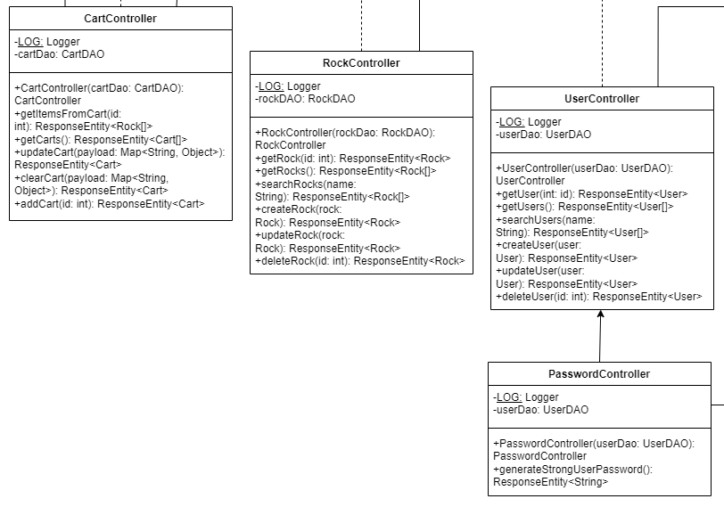

### Model Tier

This tier is directly invloved in the creation, storage, and maintence of data and the different entities that make up the prodcut

#### Rock

This class defines what a rock object should look like, and the properties it holds.

#### RockDao

This class creates an interface in order to access or manipulate the information related to the rock object which can then be implemented by some storage system.

#### User

This class defines what a user object should look like, and the properties it holds.

#### UserDao

This class creates an interface in order to access or manipulate the information related to a user which can then be implemented by some storage system.

#### Cart

This class defines what a shopping cart object should look like, and the properties it holds.

#### CartDao

This class creates an interface in order to access or manipulate the information related to a shopping cart which can then be implemented by some storage system.

#### Password

This class handles the methods for checking if a password meets our security requirments, hashing passwords, and generating strong passwords.

#### Model Tier Summary

The model tier is the core of the application. It defines essential classes and interfaces for managing rocks, users, and shopping carts. These components manipulate the data of and interaction with the application to make sure the business logic and information is handled consistently

#### Model UML Class Diagram
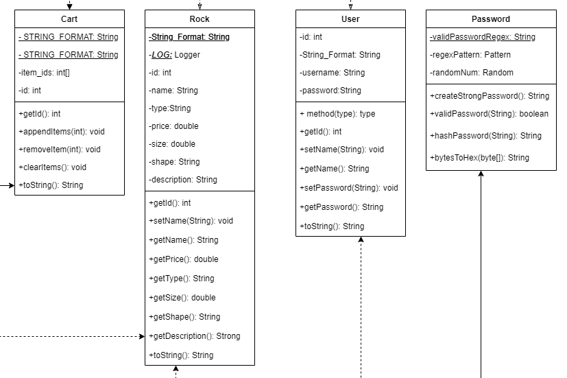

#### Data Access Objects UML Class Diagram
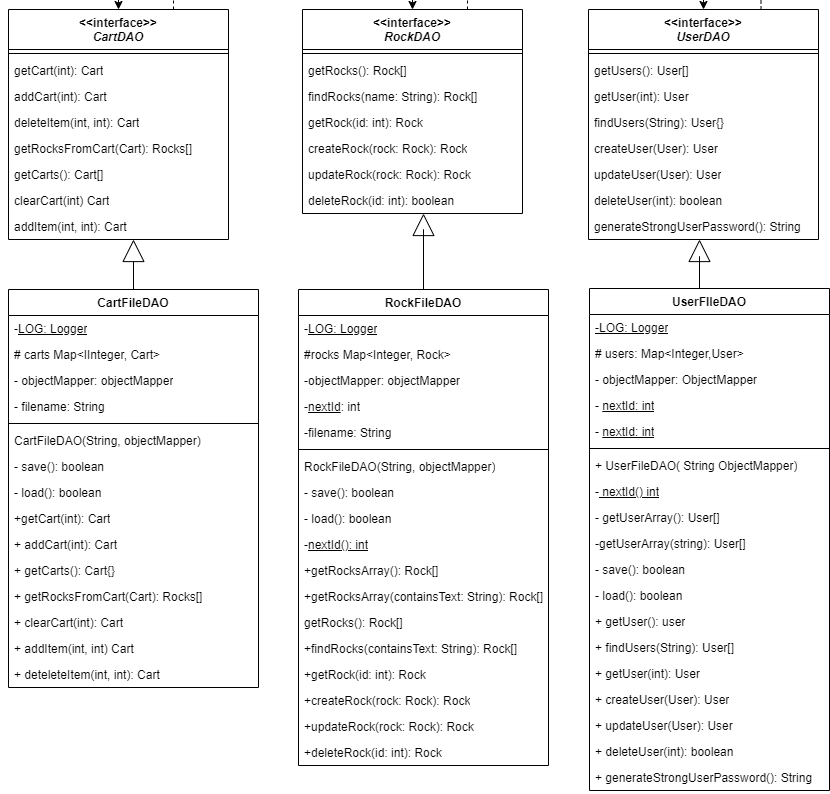

#### Model and ViewModel Tier UML Class Diagram
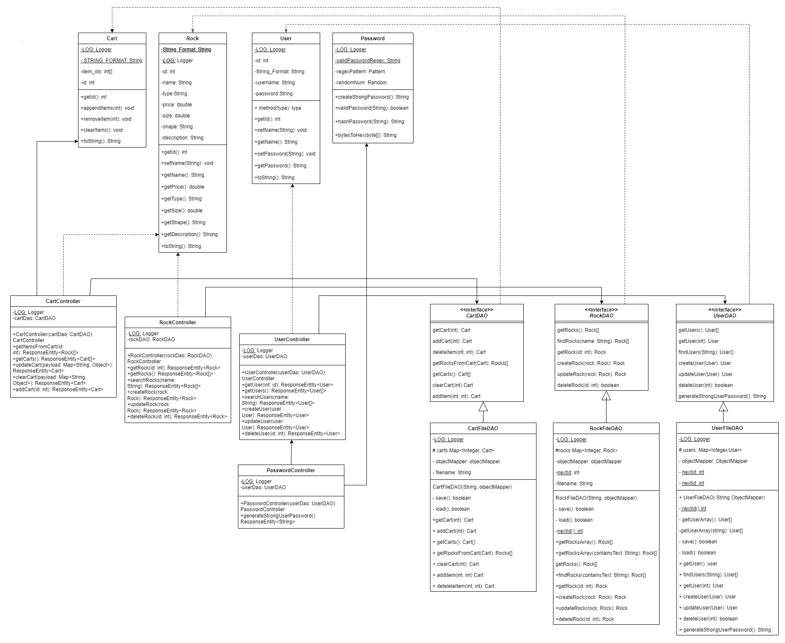

## OO Design Principles

We have considered the following OO principles for our project:
	* **Single Responsility:** Each class is responsible for one task and should be very good at that one task
	* **Dependency Inversion:** High level classes should not rely on lower level classes instead they should rely on abstractions
	* **Information Expert:** The class that has the information needed to complete a task should be the one to implement it
	* **Open/Closed:** A class should be extended by another class not modified
	* **Law of Demeter:** Keep coupling low. Meaning that a class should only use the methods of the classes directly linked to it.
	* **Pure Fabrication:** Creating helper classes to maintain single responsibility

### Single Responsibility

Single Responsibility is implemented through our controller classes, which handle all our API calls without concerning themselves with how the data is stored.

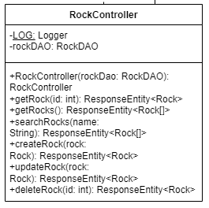

Similarly, the DAO does not worry about how data is requested; it simply interacts with the controller.

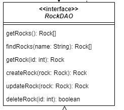

By examining the tiers and layers diagram in the architecture and design summary, one can observe the varied responsibilities of the classes in the model. Some perform the actual modeling, while others handle persistence for API call handling and storage. Within these different tiers, there are classes dedicated to managing specific information, whether it pertains to users, carts, or rocks.

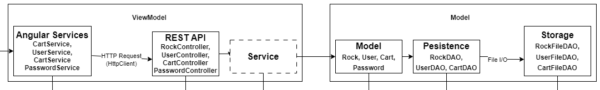

### Dependency Inversion

Dependency Inversion dictates that high-level modules should not rely on lower-level modules; instead, they should each depend on abstractions. We implemented this principle in our model through the RockDao, UserDao, and CartDao classes. These classes are abstract and define method headers that can be utilized by a lower-level class to specify the behavior of each method, allowing a higher-level module to call these methods to retrieve information. If the method of accessing or storing our objects changes, we can create a new implementation of the class without affecting our higher-level HTTP calls. As evident in our model class diagrams, the DAO classes are abstract interfaces for the FileDao classes to implement. Additionally, the controllers in the model class diagram utilize these interfaces rather than directly connecting to the FileDao implementations. This is further supported by the following code snippet, which displays the constructor for the Rock Controller and demonstrates how a dependency can be injected as long as it implements the RockDao interface.

#### CartDAO Dependency Inversion Class Diagram
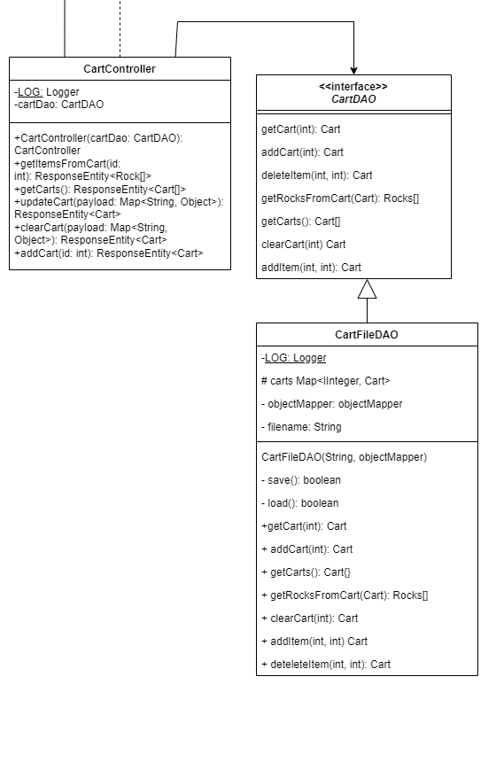

#### RockController Constructor Which Uses Depencency Inversion

### Pure Fabrication

One of the classes that is purely fabricated in our project is the Password class. The Password class does not represent an entity as depicted in our domain model. However, to maintain single responsibility and keep password checking and generation separate from the user class, we decided to create the Password class within the model, as illustrated in both our model class diagram and tiers-layers diagram.

#### Password Class Model
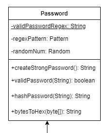

#### Password Controller Model

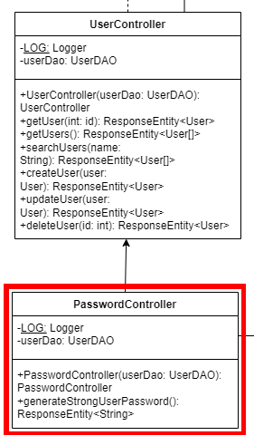

### Information Expert

We apply the Information Expert principle to our design with many of our domain entities. Our RockController class is an expert on managing rocks and their quantities. It includes methods for adding, removing, and updating rocks.

#### Controllers
Controllers are used when needed to make api calls to any of our objects instead of having the UI directly interact with our data.

The Rock class has its own price and description making it an expert in holding and providing information about rocks.

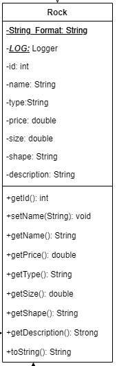

The Cart class representing a shopping cart is an expert in managing the rocks selected by a customer for purchase. It can hold the selected rocks and has behaviors like adding, removing, or updating quantities of rocks in the cart.

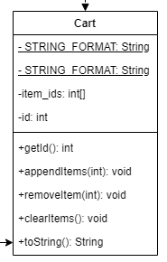

## Testing

### Acceptance Testing

#### Sprint 1
There were 7 user stories, all of which had all of their acceptance criteria pass.

#### Sprint 2
We planned to complete an additional 11 user stories, at the end of which
* 8 had passed all of their acceptance criteria
* 3 that had mostly but not fully passed their acceptance criteria. The acceptance criteria that failed were
	* Given that I am on the products page when there are products in the inventory, then I see each product and a short description of it.
	* This had failed becuase we had yet to include all fields of a rock item in the details page
	The follwing acceptance criteria failed due to the deicison of moving away from the admin using product ids and rather interacting with a GUI, as a result
	the acceptance criteria will be modified or removed for sprint 3.
	* Given a user is logged in as an admin when that user enters a valid product id and attempts to remove it then the product is removed from our inventory
	* Given a user is logged in as an admin when that user enters an invalid product id and attempts to remove it then the product is not remove from our inventory
	* Given a user is logged in as an admin when that user enters a valid product id and valid product information and attempts to updates it then the product is updated in our inventory
	* Given a user is logged in as an admin when that user enters an invalid product id or invalid product information and attempts to update it then the product is not updated in our inventory

### Sprint 3
We planned to complete an additional 10 user stories. By the end of the sprint,
* All failed acceptence criteria from Sprint 2 have passed.
* 9 sprint 3 user stories had passed all of their acceptance criteria
* 1 user story had four failed acceptance criteria due to choosing not to implement the user story. The acceptance criteria that failed were
  * Given I am logged in when I am viewing the website then I expect to see an option to change my password
  * Given I am logged in when I on the page to change my password then I expect to be able to enter a new password and be able to click a button to change it
  * Given I am logged in and I am on the page to change my password when I enter a new password that isn't empty and click the button to confirm then I should only be able to sign in with that new password
  * Given I am logged in, I am on the page to change my password, and I do not enter a new password when I click the button to confirm changing my password then nothing should happen

For Sprint 3 we had 11 user stories of which all passed their acceptance criteria

### Unit Testing and Code Coverage

### Overall Code Coverage
Our code coverage dropped during sprint 3

### Anomalies
We only have one anomaly, and it is the CartFileDAO.java class. This class was difficult to write tests for and eventually we weren't able to complete them all. More specifically, the challenges came from ensuring that file writing is done correctly.

## Ongoing Rationale
* (2024/03/17): Sprint #2: Decided to have the admin only update and delete through the UI instead of using id's to interact with specific projects.
* (2024/04/02): Sprint #3: Decided not to include a password setting UI or the ability to change your existing password due to complications with keeping the enhanced password security and requirements
