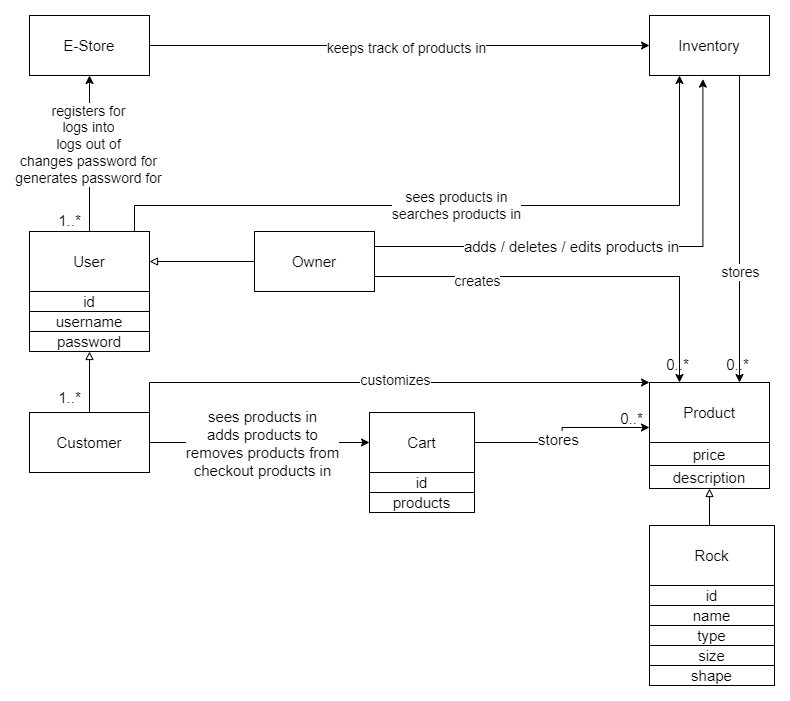
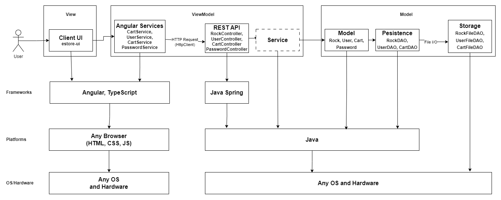

# PROJECT Design Documentation

> _The following template provides the headings for your Design
> Documentation.  As you edit each section make sure you remove these
> commentary 'blockquotes'; the lines that start with a > character
> and appear in the generated PDF in italics but do so only **after** all team members agree that the requirements for that section and current Sprint have been met. **Do not** delete future Sprint expectations._

## Team Information
* Team name: Party Rockers
* Team members
  * Ryan Lembo-Ehms
  * Ethan Battaglia
  * Victor Rabinovich
  * Samuel Roberts
  * Alex Carron

## Executive Summary

Party Rockers is an ecommerce website that customers can buy rocks to fufill all of their geological desires. On this website customers can sign in with their own username
and secure password, at which point they will have access to the many rock on the website. Customers will be able to look at the details of their rocks and even customize them.
Once they found the items of their choice they'll be able to add them to their cart at which point they will be able to checkout and get the rocks of their dreams. Admins will be able to set inventory and add/edit/remove items from the store.

Remember it's not just a boulder it's a rock.

### Purpose
We are developipng this website as a term project for a class in preparation of our peers using our website at the end of the semester.

This project involves building an e-store platform for selling rocks. They're are two main user groups.

#### E-Store Owners
Small business owners specializing in selling rocks who require a customized e-store for their business

They're user goals are to...
- Manage rock inventory.
- Have authentication for accessing the platform.
- Add, remove, and edit rock products.
- Ensure persistent data storage to reflect changes made by users.

#### Customers
Users interested in purchasing rocks from the e-store

They're user goals are to...
- View a list of available rocks.
- Search for specific types of rocks.
- Add or remove rocks from the shopping cart.
- Complete purchases securely through checkout.

### Glossary and Acronyms
> _**[Sprint 2 & 4]** Provide a table of terms and acronyms._

| Term | Definition |
|------|------------|
| SPA | Single Page |
| OO  | Object Oriented |
| MVVM | Model View ViewModel |
| HTML | Hypertext Markup Language |
| CSS | Cascading Style Sheets |
| DAO | Data Acess Object |
| API | Application Programming Interface |
| UI | User Interface |
| GUI | Graphical User Interface |

## Requirements

This section describes the features of the application.

### Definition of MVP
> _**[Sprint 2 & 4]** Provide a simple description of the Minimum Viable Product._

Enable users to register and log in with basic authentication. Customers can browse a list of rocks, search by name, add/remove items from their cart, and proceed to checkout. Admins can manage inventory by adding/removing rocks, updating details, and setting quantities. Data persistence ensures continuity across user sessions. Additional features include rock customization for customers and password authentication for enhanced security.

### MVP Features

* Creating and signing into an account
* Shopping carts tied to a specific user
* Inventory management
* Adding and removing items to a cart
* Retain items in cart after logging out and then signing back in
* Reserved admin account
* Search for items
* See a list of items
* Strong and secure passwords
* Product customization

## Application Domain

This section describes the application domain.

> _**[Sprint 2 & 4]** Provide a high-level overview of the domain for this application. You
> can discuss the more important domain entities and their relationship
> to each other._

The domain of this application is an e-store system where users interact with products in an inventory. Users, who can be either an owner or customers, register, log in, and log out of the e-store. Users browse products in the inventory, search for specific items. Only customers add them to their cart and proceed to checkout. Only owners can manage products in the inventory.

## Architecture and Design

### Summary

The following Tiers/Layers model shows a high-level view of the webapp's architecture.
**NOTE**: detailed diagrams are required in later sections of this document.

The web application, is built using the Model–View–ViewModel (MVVM) architecture pattern.

The Model stores the application data objects including any functionality to provide persistance.

The View is the client-side SPA built with Angular utilizing HTML, CSS and TypeScript. The ViewModel provides RESTful APIs to the client (View) as well as any logic required to manipulate the data objects from the Model.

Both the ViewModel and Model are built using Java and Spring Framework. Details of the components within these tiers are supplied below.

### Overview of User Interface

This section describes the web interface flow; this is how the user views and interacts with the web application.

> _Provide a summary of the application's user interface.  Describe, from the user's perspective, the flow of the pages in the web application._

When the user first opens up the website they will be placed on the sign up/sign in screen. If they are an admin they will be able to sign in with the reserved credtials of admin admin and will then be transported to the dashboard. Otherwise a customer will either have to create an account or sign in with their own existing account. On the dashboard both customers and the admin can search for products and see the top 5 products. There is also a button to go to the products page, where a user can see all the availbile items. When clicking on an item to go its detail page a customer will see the products informtion, a customization menu, and a add to cart button. If the user slects add to cart the item gets added and the user can see this by selecting the cart button at the top of the page. Admins will have the same information but rather than a add to cart button there is a menu to update the product information and save this information. Finally when a customer is in their cart and ready to checkout they hit the checkout button, which will direct them to a page to put in their information at which point they can pay for their items.

### ViewModel Tier

  * RockController Class - This class creates the REST API calls such that the Angular view can send a http request to the ViewModel and a corresponding action from the  rock model takes place. This class creates the urls for the calls, and defines what functions it will call, status codes to return and error handles.
  * UserController Class - This class creates the REST API calls such that the Angular view can send a http request to the ViewModel and a corresponding action from the User model takes place. This allows for calls to create new users, updating users, retrieving users, and gathering the information necessary to sign in users.
  * CartController Class - This class create the REST API call such that the Angular view can sent a http request to the ViewModel and a corresponding action from the user model takes place.  This allows for calls to add, delete, and view the shopping cart.
  * PasswordController Class - This class create the REST API call such that the Angular view can sent a http request to the ViewModel and a corresponding action from the user model takes place.  This allows for calls to generate a strong password.
> _**[Sprint 4]** Provide a summary of this tier of your architecture. This
> section will follow the same instructions that are given for the View
> Tier above._

> _At appropriate places as part of this narrative provide **one** or more updated and **properly labeled**
> static models (UML class diagrams) with some details such as critical attributes and methods._
>

### Model Tier

  * Rock - This class defines what a rock object should look like, and the properties it holds.
  * RockDao - This class creates an interface in order to access or manipulate the information related to the rock object which can then be implemented by some storage system.
  * User -  This class defines what a user object should look like, and the properties it holds.
  * UserDao - This class creates an interface in order to access or manipulate the information related to a user which can then be implemented by some storage system.
  * Cart - This class defines what a shopping cart object should look like, and the properties it holds.
  * CartDao - This class creates an interface in order to access or manipulate the information related to a shopping cart which can then be implemented by some storage system.
  * Password - This class handles the methods for checking if a password meets our security requirments, hashing passwords, and generating strong passwords.

> _**[Sprint 2, 3 & 4]** Provide a summary of this tier of your architecture. This
> section will follow the same instructions that are given for the View
> Tier above._

The model tier is the core of the application. It defines essential classes and interfaces for managing rocks, users, and shopping carts. These components manipulate the data of and interaction with the application to make sure the business logic and information is handled consistently

> _At appropriate places as part of this narrative provide **one** or more updated and **properly labeled**
> static models (UML class diagrams) with some details such as critical attributes and methods._
>

## OO Design Principles

We have considered the following OO principles for our project:
  * Single Responsility - Each class is responsible for one task and should be very good at that one task
  * Dependency Inversion - High level classes should not rely on lower level classes instead they should rely on abstractions
  * Information Expert - The class that has the information needed to complete a task should be the one to implement it
  * Open/Closed - A class should be extended by another class not modified
  * Law of Demeter - Keep coupling low. Meaning that a class should only use the methods of the classes directly linked to it.
  * Pure Fabrication - Creating helper classes to maintain single responsibility

> _**[Sprint 2, 3 & 4]** Will eventually address up to **4 key OO Principles** in your final design. Follow guidance in augmenting those completed in previous Sprints as indicated to you by instructor. Be sure to include any diagrams (or clearly refer to ones elsewhere in your Tier sections above) to support your claims._

- Single Responsibility:  Single Responsibility is used through our controller classes when we use them to handle all our api calls and doesn't need to care about how the data is stored. Similarly, the DAO does not worry about how data is being asked for as it just interacts with the controller. If you look at the tiers and layers diagram within the architecture and design summary it can be seen how the classes in the model have different responsibilies. Some perform the actual model, others are persistence for API call handeling, and then storage. And within these different tiers there are classes to handle certain information whether it be related to users, carts, or rocks.

- Dependency Inversion: Dependency Inversion tells us that high level modules should not rely lower level modules instead they should each rely on abstractions. We implemented this in our model via the RockDao, UserDao, and CartDao classes. These classes are abstract classes that define method headers that can be used by a lower level class to define the behavior of each method, and used by a higher level module to call these methods so it can retrieve information. If the way we access or store our objects changes we can create a new implementation of the class without affect our higher level http calls. As seen with our model class diagrams we have the DAO classes that are abstract classes that are interfaces for the FileDao classes to implement. Also seen in the model class diagram is how the controllers use the interface rather than directly connecting to the FileDao implementations. This is further supported with the following code snippet which displays the constructor for the Rock Cotnroller and demonstrates how a dependency can be injected as long as it implements the RockDao interface.

- Pure Fabrication: One of the classes that is a pure fabrication in our project is the Password class. Password does not represent an entity as seen in our domain model, however to maintain single responsibility, by keeping password checking and genration out of the user class, we decided to make the Password class in the model as shown in our model class diagram and tiers-layers diagram.

- 

> _**[Sprint 3 & 4]** OO Design Principles should span across **all tiers.**_

- **Controllers** are used when needed to make api calls to any of our objects instead of having the UI directly interact with our data.

## Testing
> _This section will provide information about the testing performed
> and the results of the testing._

### Acceptance Testing
> _**[Sprint 2 & 4]** Report on the number of user stories that have passed all their
> acceptance criteria tests, the number that have some acceptance
> criteria tests failing, and the number of user stories that
> have not had any testing yet. Highlight the issues found during
> acceptance testing and if there are any concerns._
For Sprint 1 there were 7 user stories, all of which had all of their acceptance criteria pass.

For Sprint 2 we planned to complete an additional 11 user stories, at the end of which 
  * 8 had passed all of their acceptance criteria
  * 3 that had mostly but not fully passed their acceptance criteria.
    The acceptance criteria that failed were 
      * Given that I am on the products page when there are products in the inventory then I see each product and short description.
      * * This had failed becuase we had yet to include all fields of a rock item in the details page
      The follwing acceptance criteria failed due to the deicison of moving away from the admin using product ids and rather interacting with a GUI, as a result
      the acceptance criteria will be modified or removed for sprint 3.
      * Given a user is logged in as an admin when that user enters a valid product id and attempts to remove it then the product is removed from our inventory
      * Given a user is logged in as an admin when that user enters an invalid product id and attempts to remove it then the product is not remove from our inventory
      * Given a user is logged in as an admin when that user enters a valid product id and valid product information and attempts to updates it then the product is updated in our inventory
      * Given a user is logged in as an admin when that user enters an invalid product id or invalid product information and attempts to update it then the product is not updated in our inventory

As of Sprint 3 all failed acceptence criteria from Sprint 2 have passed.
      

### Unit Testing and Code Coverage

>_**[Sprint 2 & 4]** **Include images of your code coverage report.** If there are any anomalies, discuss
> those._

### Overall Code Coverage
In general, we had excellent code coverage. In fact, nearly all files were completely covered except a couple.

### Anomalies
We only have one anomaly, and it is the CartFileDAO.java class. This class was difficult to write tests for and eventually we weren't able to complete them all. More specifically, the challenges came from ensuring that file writing is done correctly.

## Ongoing Rationale
>_**[Sprint 1, 2, 3 & 4]** Throughout the project, provide a time stamp **(yyyy/mm/dd): Sprint # and description** of any _**mayor**_ team decisions or design milestones/changes and corresponding justification._

(2024/03/17): Sprint #2 Decided to have the admin only update and delete through the UI instead of using id's to interact with specific projects.
